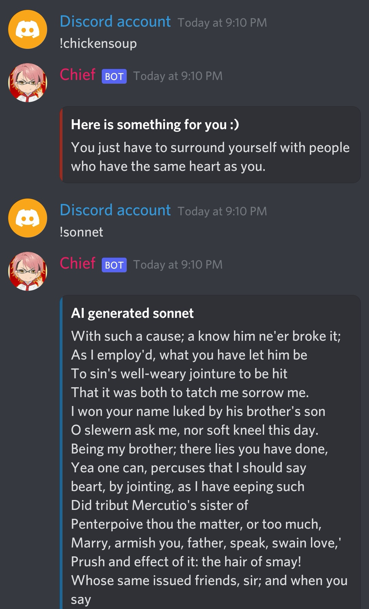

# discord-bot
A discord bot just for fun


## Installation

```git clone https://github.com/FISHWONGY/discord-bot/```

```pip install -r requirements.txt```

## Hosting
1. Login to [DISCORD Developer](https://discord.com/developers/docs/intro)
2. Set up your BOT on the portal - for token

## Current usages
- Auto Reply
    - Auto reply when text messeges/ command is received
- Web scrapper
    - Scrape https://www.f1.com to get F1 weekly race calender 
    - Scrpae the F1 website to get current driver/ constructor championship stnading
- Count down
    - Count down function to certain date/ events


## Example Output

